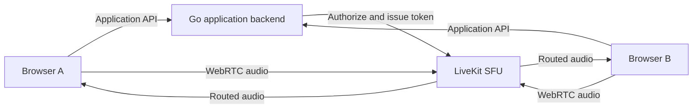

# Architecture

## Current MVP Route



The Go backend owns application state and access control. LiveKit owns media-session signaling and audio routing. Audio must not travel directly between browsers.

## Responsibilities

### Go backend

- application HTTP API;
- authentication and authorization;
- room access validation;
- temporary LiveKit token issuance;
- configuration validation;
- health checks.

The backend must not proxy audio through ordinary HTTP handlers.

### Application API

- `GET /health` reports backend liveness.
- `POST /api/rooms/{room}/token` validates the room name and requested identity, then
  issues a short-lived LiveKit access token (`livekit.DefaultTokenTTL`) that grants
  join, publish, and subscribe access to that room only. The client uses the
  returned token and LiveKit URL to establish the WebRTC session directly with LiveKit.

### React frontend

- user-facing call controls;
- connection state presentation;
- microphone permission handling;
- LiveKit client lifecycle;
- participant and active-speaker presentation.

Visual components must not manage network connections directly. Keep the LiveKit lifecycle in a dedicated frontend layer or hook.

### LiveKit SFU

- media-session signaling;
- WebRTC transport;
- Opus audio routing;
- participant connection state;
- server-side forwarding of audio streams.

coturn can be added for restrictive networks. When strict relay routing is required, clients must use `iceTransportPolicy: "relay"`.

## State Model

The call state is explicit:

```text
idle -> connecting -> connected -> reconnecting -> connected
                         |                 |
                         v                 v
                       failed            ended
```

Invalid transitions must be rejected and covered by tests.
